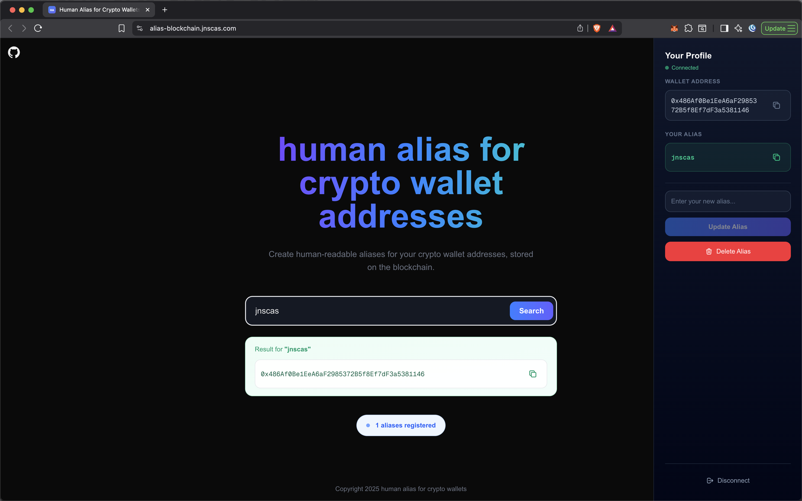

# Alias Blockchain

A decentralized alias registry on Ethereum that allows users to create human-readable aliases for their crypto wallet addresses, stored permanently on the blockchain.

## Overview

Instead of sharing long hexadecimal wallet addresses like `0x742d35Cc6634C0532925a3b844Bc9e7595f...`, users can register memorable aliases and share those instead. The mapping between aliases and addresses is stored on-chain, making it transparent and censorship-resistant.



## Features

- **On-chain storage** - Aliases are stored directly on the Ethereum blockchain
- **MetaMask integration** - Connect your wallet with one click
- **Alias lookup** - Search for any alias to find the associated address
- **Update alias** - Change your alias at any time (one alias per address)
- **Delete alias** - Remove your alias from the registry
- **Real-time sync** - UI updates instantly with blockchain state

## Project Structure

```
alias-blockchain/
├── frontend/              # Next.js application
│   ├── app/
│   │   ├── components/    # React components
│   │   ├── providers/     # Web3 context provider
│   │   └── services/      # Blockchain service layer
│   └── contracts/         # ABI and contract address
│
└── web3/                  # Smart contracts
    ├── contracts/         # Solidity source files
    ├── ignition/          # Deployment modules
    ├── test/              # Contract tests
    └── scripts/           # Utility scripts
```

See the README in each directory for setup instructions:
- [Frontend README](./frontend/README.md)
- [Web3 README](./web3/README.md)

## Deployment

The project includes a GitHub Actions workflow for automated deployment:

1. Builds the frontend Docker image
2. Pushes to Docker Hub
3. Deploys to production server via SSH

Trigger manually via GitHub Actions with a version tag.

## License

MIT
